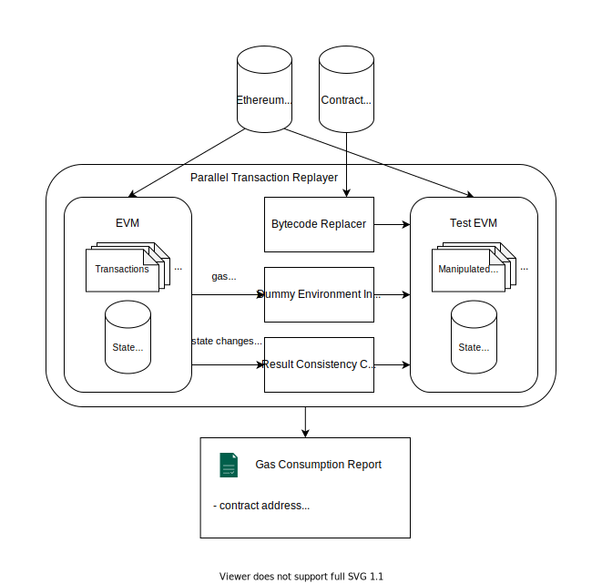

## Introduction

This tool is used for Ethereum transaction replay and verification. The code is modified on the Geth client version 1.9.25.
Ability to replay a range of transactions (specified by block number) and collect the resulting results.

At present, this tool is suitable for one scenario of smart contract gas optimization, the user provides all blocks and the optimized contract as the input of the tool, and the tool replays all transactions for the original contract and the optimized contract respectively.
Then output the gas consumption of all transactions of the contract before and after optimization.


## Run

1. Switch to replayer branch
```shell
git checkout replayer
make geth
```

2. Create data folder
```shell
cd build/bin
rm -rf eth-data
rm -rf eth-data-tainted
mkdir eth-data
mkdir eth-data-tainted
```

3. Specify the rlp blockchain file path
   

```shell
rlp_file_paths='0To400w.rlp 400wTo500w.rlp 500wTo600w.rlp'
```

4. Modify the configuration file `monitor-config.json`，set `replaceContractCode` equal`false`
```json
{
  "replaceContractCode": false
}
```

5. Start a Geth client (corresponding to the EVM on the left side of the figure) and start replaying the transaction, hereinafter referred to as the A process
```shell
nohup ./build/bin/geth --datadir ./build/bin/eth-data --syncmode full import $rlp_file_paths &> nohup-before.out &
```

6. Modify the configuration file `monitor-config.json`，set`replaceContractCode`=`true`
```json
{
  "replaceContractCode": true
}
```

7. Start the second Geth client (corresponding to the Test EVM on the right side of the figure) and start replaying the transaction, hereinafter referred to as the B process
```shell
nohup ./build/bin/geth --datadir ./build/bin/eth-data-tainted --syncmode full import $rlp_file_paths &> nohup-after.out &
```

8. Collect result data

Several CSV files with file names starting with `monitor-` will be generated in the directory for saving the results. Among them, `monitor-before-*.csv` is the file generated by process A, `monitor-after-*.csv` It is a file generated by the B process.

Process A only writes files. In addition to writing files, process B also continuously reads files output by process A (there are exceptions, see below).

```
monitor-before-replay.csv                               Raw transaction data
monitor-before-gas-brief.csv                            Gas related data in raw transaction data (monitor-before-replay.csv)
monitor-before-gas-brief-snippet.csv                    Read and write buffers for the above files
monitor-before-call-chain-gas-site-info.csv             The remaining gas data when the function call occurs in the original transaction data
monitor-before-call-chain-gas-site-info-snippet.csv     Read and write buffers for the above files
monitor-before-call-chain-evm-error.csv                 EVM exception information that occurs when a function call occurs in the original transaction data
monitor-before-call-chain-evm-error-snippet.csv         Read and write buffers for the above files
monitor-before-opcode-statistics.csv                    Statistics of opcodes executed in raw transactions

monitor-after-replay.csv                                Modified transaction data
monitor-after-gas-brief.csv                             Gas-related data in the modified transaction data (monitor-after-replay.csv)
monitor-after-code-replace-log.csv                      The log information generated when the contract bytecode is replaced
monitor-after-error-log.csv                             Error message when replacing contract bytecode
monitor-after-original-block-hash.csv                   The original hash of the block after the modified transaction has been executed
monitor-after-tainted-block-hash.csv                    The tampered hash of the block after the modified transaction is executed
monitor-after-opcode-statistics.csv                     Statistics of opcodes executed in the modified transaction
```

Note: The following three read-write buffer files are written by process A and read by process B. After process B has finished reading one round, the file will be emptied.

In order to ensure the correctness of reading and writing, locking and unlocking operations will be performed, so there will be three empty files named `*.csv.lock` on the disk, which are the locks corresponding to these three files.
```
monitor-before-gas-brief-snippet.csv
monitor-before-call-chain-gas-site-info-snippet.csv
monitor-before-call-chain-evm-error-snippet.csv
```

The important information is located in the `monitor-before-replay.csv` and `monitor-after-replay.csv` files, these two files include all transaction data, other files are not important.

Data format, the meaning of each column is as follows:

```
transactionHash         Transaction hash
blockNumber             Block number
transactionIndex        The sequence number of this transaction in the block
hitMonitoredAddresses   Which monitored addresses were triggered by this transaction (there can be multiple, comma-separated)
hitPoints               Trigger point, possible values: "from", "to", "dirty", "callee", "readee" (multiple, comma-separated)
                        From: The transaction originating address is the monitored address
                        To: The transaction receiving address is the monitored address
                        Dirty: The state variable of a contract is modified during the execution of the transaction, and the address of the contract is the monitored address
                        Callee: A function of a contract is called during transaction execution, and the address of the contract is the monitored address
                        Readee: The code of a contract is read during transaction execution, and the address of the contract is the monitored address
from                    Transaction originating address
to                      Transaction receiving address
value                   Transfer amount (integer >= 0)
gasUsed                 Gas consumption
input                   Input arguments to function call (hex)
return                  Return value of function call (hex)
error                   Error message
postJournal             After the transaction is completed, the state change log of the database (JSON format)
time                    The time at which this transaction was executed (system time on the current machine)
```


## Project Description



To measure how much gas can be saved using our methodology, we conduct a repeatable experiment. The basic idea is simple.
For contracts before and after optimization, we deploy them respectively (for two times) on a private Ethereum node,
executed their transactions, and record gas consumption during the executions. Then, we compare the difference of the
total gas consumption.

However, some subtle challenges must be addressed for this idea to work:
1. Contracts can invoke other contracts which are out of scope (contracts that are not optimized with our methodology).
   Also, an optimized contract can be invoked by another contract which is out of scope.
2. During the execution of a transaction, an optimized contract can consume different gas from the original one. Since
   contracts have access to run-time information for available gas, they can behave differently when the gas consumption
   is different. Only if the optimized contracts behave exactly the same as the original ones, can our optimization be
   considered correct.
3. Solving the previous issue requires logging all state changes of each transaction for later comparison, which is
   prohibitively expensive, costing the experiment a huge amount of memory or disk space to complete.

To address the problems, we design a parallel transaction replayer to fully replay all transactions on Ethereum Mainnet
by block number 12,196,875. The replayer consists of two EVMs and several modules. The original contracts and the
optimized ones will be respectively deployed on the EVM and the test EVM, so will their original transactions and
manipulated ones be respectively executed. We feed the replayer with optimized contract bytecode and Ethereum blocks
which are synchronized from the Ethereum network, after which the replayer executes all transactions within the blocks.
The first module, bytecode replacer, monitors the test EVM and replace the contract bytecode by optimized one in
transactions which deploy contracts. The second module, dummy environment information supplier, cheats contracts running
in the test EVM, making them perceive available gas as the same as the EVM, to ensure their behavioral consistence.
The third module, result consistency checker, checks whether the state changes and run-time errors in the test EVM are
the same as in the EVM. The replayer keeps monitoring the two EVMs and logs gas consumption whenever an optimized
contract is touched (its code being accessed or its state being changed) in a transaction. Cleverly, to avoid excessive
space used by the information transmission between the two EVMs required by the second and the third module, the
replayer runs in a lockstep manner: one of the two EVMs pauses and waits for its peer to run to the same block when it
runs too fast, producing too much information. Finally, the replayer produces a report containing gas consumption of all
contracts before and after optimization.